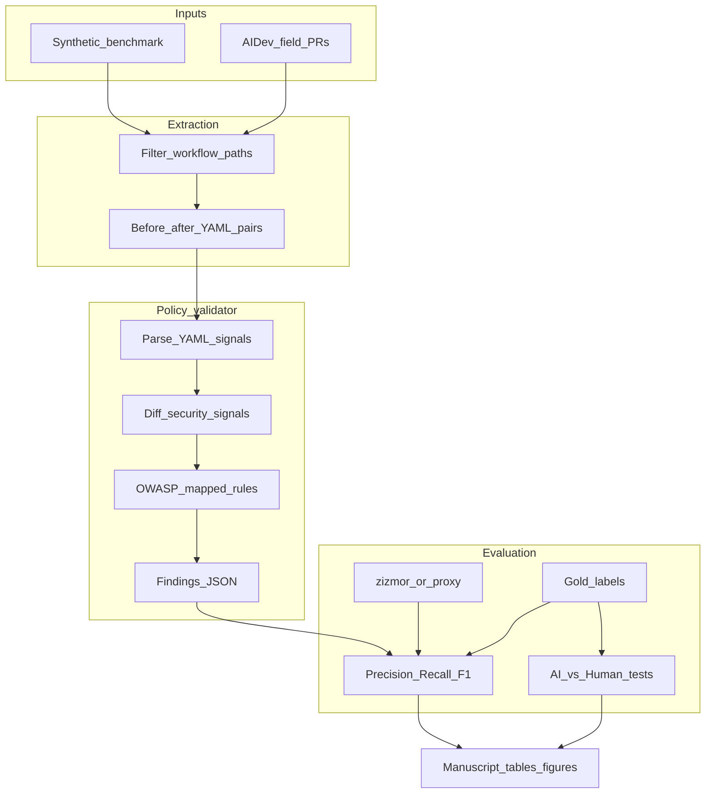

# Figure: Study and method architecture

```mermaid
flowchart TB
  subgraph inputs [Inputs]
    Samples[Synthetic_benchmark]
    AIDev[AIDev_field_PRs]
  end
  subgraph extract [Extraction]
    Filter[Filter_workflow_paths]
    Pairs[Before_after_YAML_pairs]
  end
  subgraph method [Policy_validator]
    Parse[Parse_YAML_signals]
    Diff[Diff_security_signals]
    Rules[OWASP_mapped_rules]
    Findings[Findings_JSON]
  end
  subgraph eval [Evaluation]
    Labels[Gold_labels]
    Metrics[Precision_Recall_F1]
    Base[zizmor_or_proxy]
    Stats[AI_vs_Human_tests]
  end
  Samples --> Filter
  AIDev --> Filter
  Filter --> Pairs --> Parse --> Diff --> Rules --> Findings
  Findings --> Metrics
  Base --> Metrics
  Labels --> Metrics
  Labels --> Stats
  Metrics --> Paper[Manuscript_tables_figures]
  Stats --> Paper
```

Export this diagram to PNG/SVG for the JAIAI DOC template if required.
